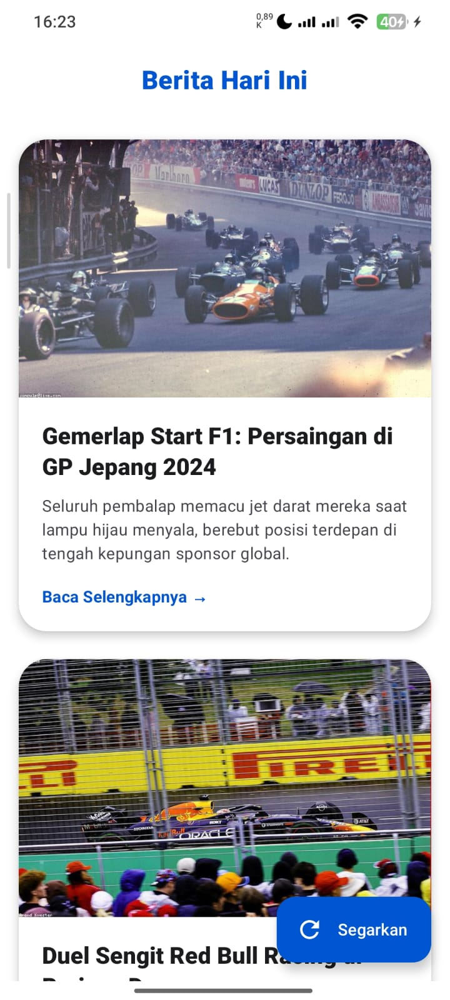

# 📰 NewsReaderApp - Berita Balapan

Aplikasi pembaca berita modern berbasis Android yang dibangun menggunakan **Jetpack Compose**. Proyek ini difokuskan pada penyampaian berita balapan (F1 & MotoGP) dengan antarmuka yang bersih, interaktif, dan performa yang optimal.

# 👤 Identitas Pengembang
- **Nama:** Gian Ivander
- **NIM:** 123140040
- **Kelas:** Pengembangan Aplikasi Mobile RA

## 🚀 Fitur Utama
- **Modern UI & Vibrant Blue Theme**: Tampilan bersih dengan latar belakang putih dan aksen biru yang memberikan kesan profesional dan segar.
- **Center-Aligned Title**: Navigasi atas yang seimbang dengan judul berada tepat di tengah.
- **Interactive Racing Cards**: Berita ditampilkan dalam bentuk kartu modern dengan gambar aksi balap, efek bayangan, dan indikator "Baca Selengkapnya".
- **Offline Caching**: Berita tetap bisa dibaca meskipun tanpa koneksi internet berkat integrasi Room Database (Local Storage).
- **Shimmer Effect**: Pengalaman pemuatan data yang halus menggunakan *skeleton screen* (Shimmer).
- **Chrome Custom Tabs**: Membuka artikel asli langsung di dalam aplikasi untuk pengalaman browsing yang mulus.

## 🏗️ Struktur Proyek
Sesuai dengan prinsip **Clean Architecture** dan pola **MVVM**, proyek ini dibagi menjadi:
- `data/`: Implementasi Repository, Room Database, DAO, dan Entities.
- `domain/`: Berisi Model data (`Article`) dan abstraksi Repository.
- `presentation/`: Berisi UI Screen (`NewsScreen`, `ArticleDetailScreen`), Komponen, dan `NewsViewModel`.
- `ui/theme/`: Pengaturan tema Material 3 (Color, Type, Theme).

## 🛠️ Tech Stack
- **Jetpack Compose** (Material 3)
- **Ktor Client** (Networking)
- **Room Persistence** (Local Database)
- **Coil** (Image Loading)
- **Compose Navigation**
- **MVVM Architecture**

## 📸 Preview
Berikut adalah tampilan aplikasi dalam berbagai kondisi:

| Halaman Utama (Home) | Detail Berita | Tampilan Browser |
| :---: | :---: | :---: |
|  |  |  |

## 🎥 Video Demonstrasi 
https://github.com/user-attachments/assets/e4ab596f-f0e0-48d0-8468-05a4cdeb3996

---
